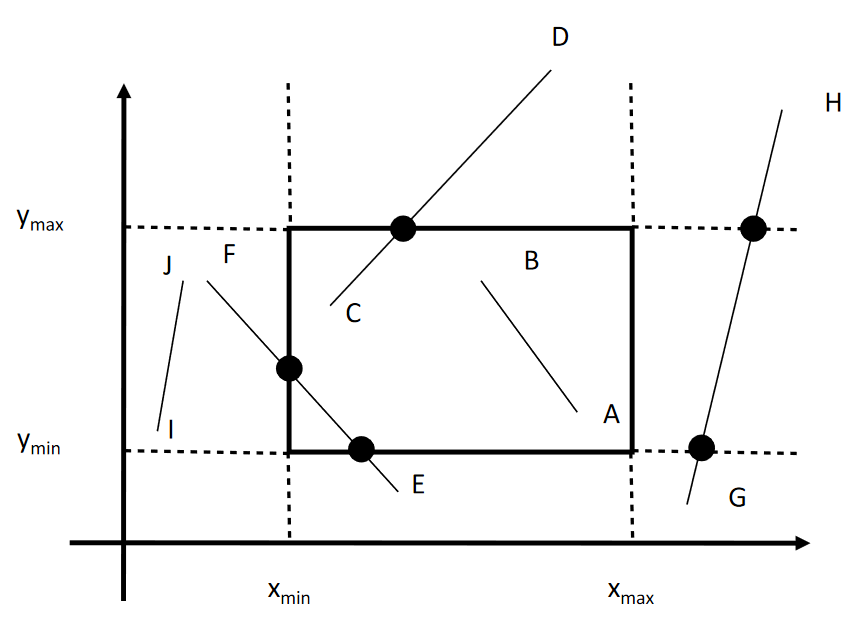

# Brute Force Clipping

1. If both end-points _within_ clip box, TRIVIAL ACCEPT
1. If at least 1 end-point is outside box
   1. Compute intersections with clip box
   1. If intersections are interior, draw portion of line in box

Easier to describe line segments \\(AB\\) using **_parametric_** equations

\begin{align}
x&=x_A+t(x_B-x_A)\\\\
y&=y_A+t(y_B-y_A)
\end{align}

If \\(t\_{edge}\\) and \\(t\_{line}\in[0,1]\\) then intersection is interior

