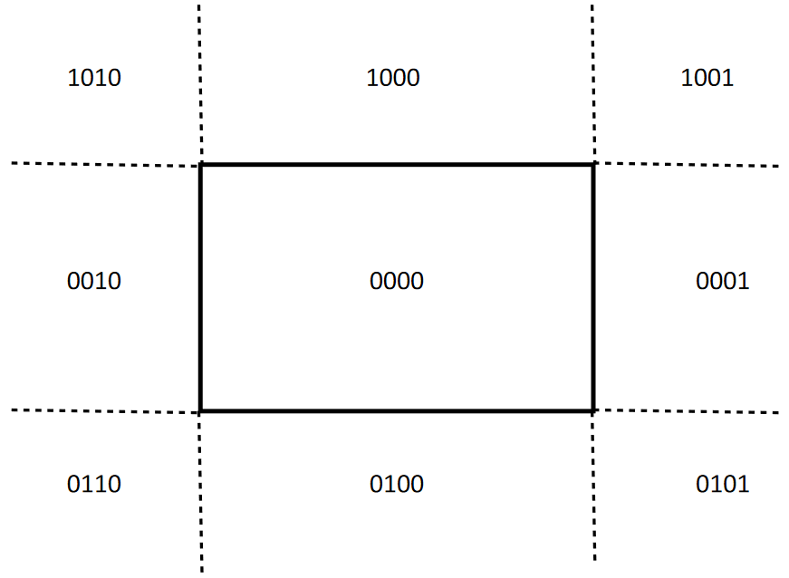
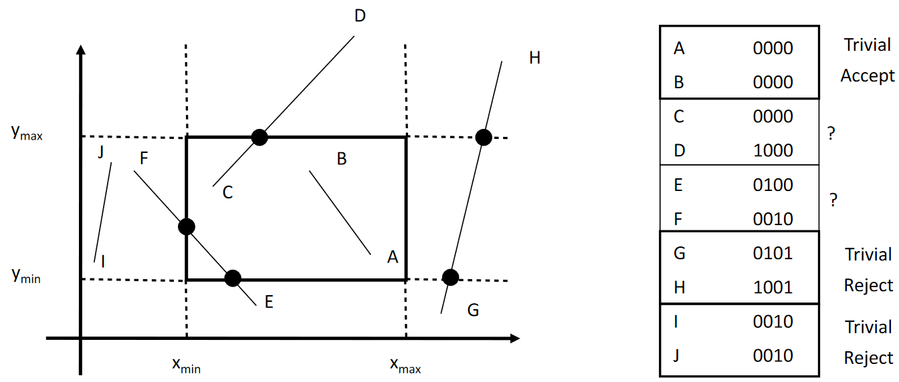

# Cohen-Sutherland

Uses simplifying tests and simple description of region in which a point lies

Efficient for two cases:

- Large clipping rectangle for TRIVIAL ACCEPTs
- Small clipping rectangle for TRIVIAL REJECTs

## Regions

4-bit **_outcodes_** \\(C=[b_3, b_2, b_1, b_0]\\) where

\\[
\begin{align}
b\_3&=y>y\_{max}\\\\
b\_2&=y<y\_{min}\\\\
b\_1&=x<x\_{min}\\\\
b\_0&=x>x\_{max}\\\\
\end{align}
\\]

Properties:

- Central region shares no bits with any other region
- Vertically or horizontally aligned regions share at least one bit

## Trivial Cases

For points \\(A\\) and \\(B\\)

| Outcome                                   | Condition                    | Explanation             |
| ----------------------------------------- | ---------------------------- | ----------------------- |
| ACCEPT | \\(C_A\lor C_B=[0000]\\)     | Both in central region  |
| REJECT     | \\(C_A\land C_B\neq[0000]\\) | Both in aligned regions |

e.g. for the example above:

## Non-Trivial Cases

Not trivial \\(\land\\,b_i=1\\) \\(\implies\\) intersects relevant clip box edge

1. Until trivial test with \\(C_A\\) and \\(C_B\\) passes
1. Scan outcodes in parallel from MSB until bit \\(b_i=1,\\,b_i\in C_P\\)
1. Compute intersection \\(P'\\) with relevant edge
   - Compute new point
     \\[
     P'=\begin{cases}(x',y\_{max/min})&i=3/2\\\\(x\_{min/max},y')&i=1/0\end{cases}
     \\]
     where
     \begin{align}
     x'&=x_P+t(x\_{P\_{other}}-x_P)&=x_P+(\frac{y\_{max/min}-y_P}{y\_{P\_{other}}-y_P})(x\_{P\_{other}}-x_P)\\\\
     y'&=y_P+t(y\_{P\_{other}}-y_P)&=y_P+(\frac{x\_{min/max}-x_P}{x\_{P\_{other}}-y_P})(y\_{P\_{other}}-y_P)
     \end{align}
1. Compute \\(P'\\)'s outcode
1. Do trivial test with \\(P'\\) and \\(P\_{other}\\)
