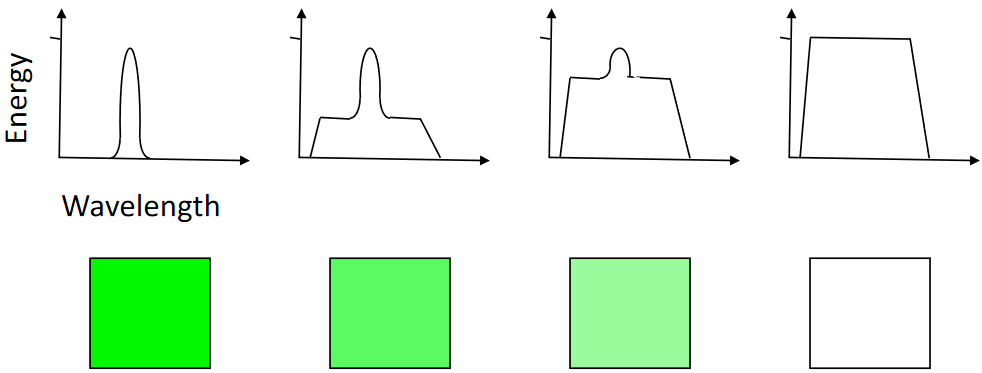
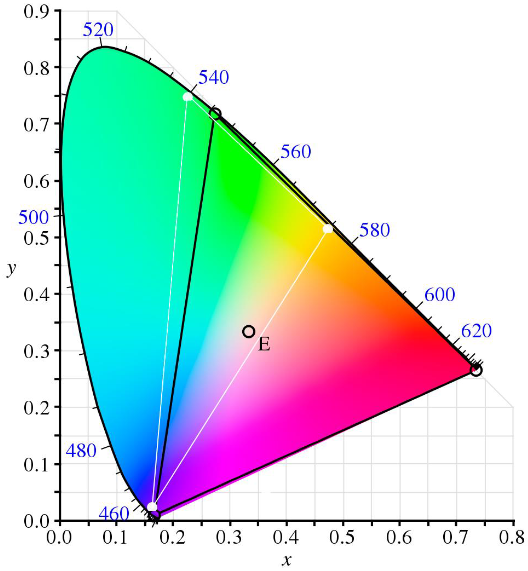

# Colour

## Definitions

| Term                | Definition                                                               |
| ------------------- | ------------------------------------------------------------------------ |
| Luminance           | Measure of colour's intensity                                            |
| Chromaticity        | Quality of colour independent of luminance                               |
| Hue                 | A colour's chromaticity                                                  |
| Saturation          | A colour's luminance (_alt._: distance from grey of same luminance)      |
| Lightness           | Achromatic perception of perceived intensity reflected from an object    |
| Brightness          | Achromatic perception of perceived intensity from a self-luminous object |
| Component primaries | Wavelengths of light that form the basis of a colour model               |
| Colour matching     | Combining component primaries to produce another colour                  |

## Grassman Colour Matching Laws

1. A colour can be matched by a linear combination of component primaries, e.g. RGB
   \\[
   C=R+G+B
   \\]
1. A mixture of colours can be matched by component-wise addition of their primaries
   \\[
   \sum{C}=\sum{R}+\sum{G}+\sum{B}
   \\]
1. Scaling a colour and its component primaries by a constant factor preserves colour, i.e. colour matching persists at all luminances
   \\[
   kC=kR+kG+kB
   \\]

NB:

- "\\(=\\)" means _"looks the same as"_
- Component primaries are measured by intensity, e.g. \\(R\\) means _"the intensity of long wavelength light"_

## Dominant Colour

Dominant wavelength corresponds to perceived chromaticity

## CIE Chromaticity Diagram

Designed by Commission Internationale de L'Eclairage

Defines colour-space relating electromagnetic wavelength distribution to human colour vision

Coordinates represent relative proportions of tristimulus values present in a given XYZ colour model

\begin{align}
1&=x+y+z\\\\
x&=\frac{X}{X+Y+Z}\\\\
y&=\frac{Y}{X+Y+Z}\\\\
z&=\frac{Z}{X+Y+Z}=1-x-y
\end{align}

## Colour Models

| Model | \\(C_X\\) | \\(C_Y\\)   | \\(C_Z\\)     | Uses                      |
| ----- | --------- | ----------- | ------------- | ------------------------- |
| RGB   | Red       | Green       | Blue          | Monitors                  |
| YIQ   | Luminance | Orange-cyan | Green-magenta | NTSC TV system            |
| HSV   | Hue       | Saturation  | Value         | Colour pickers            |
| HLS   | Hue       | Lightness   | Saturation    | Colour pickers            |
| CMY   | Cyan      | Magenta     | Yellow        | Printing (with black ink) |
