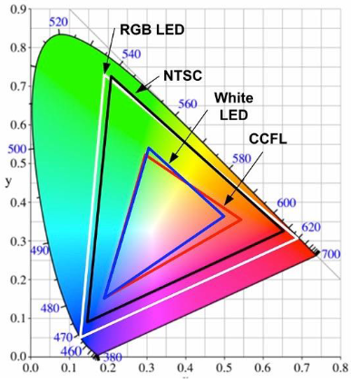
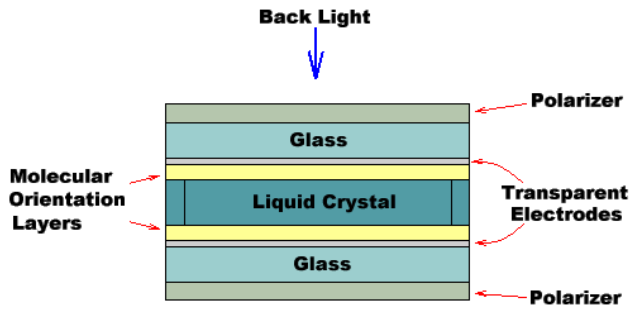
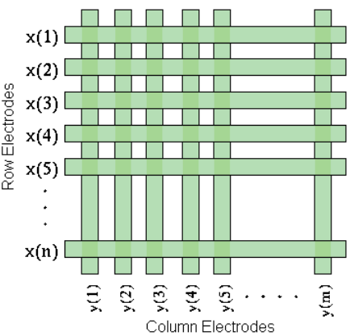
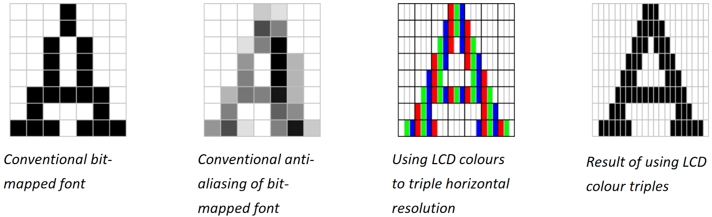
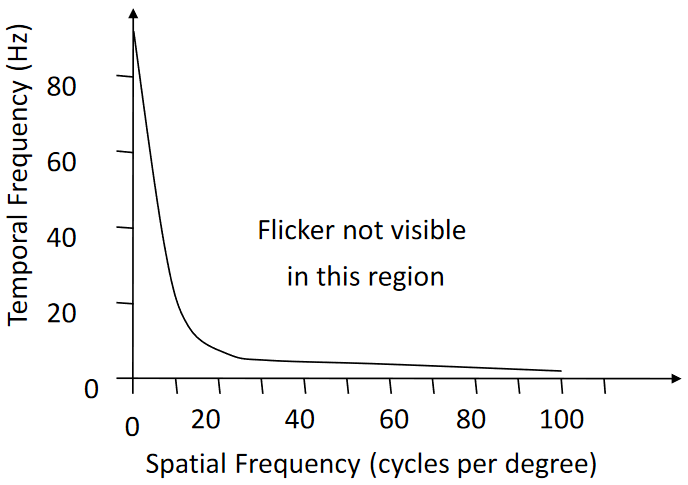

# Displays

## Cathode-Ray Tube (CRT)

- Refresh
  - Deflection coils beam electrons onto phosphor-coated screen
  - Phosphor emits rapidly-fading light (10-60ms)
  - Must redraw rapidly (≥60fps)
  - Fade time varies across phosphors
  - Resolution determined by brightness, phosphor and deflection system
- Vector
  - Beam follows arbitrary path tracing connected sloped lines
  - Skips over dark areas
  - Flicker apparent when many lines are to be drawn
- Raster
  - Sweeps horizontal lines
  - Image stored in frame buffer
  - Output synchronised to raster scan
  - Typically ~70fps
  - Interlaced - frame split into even and odd lines
- Colour
  - Three electron beams illuminate RGB phosphors
  - Delta (honeycomb) or In Line phosphor arrangement
  - Shadow masks focus beams

## Colour Gamut

Gamut - line/triangle (2/3 primary components) on CIE colour-space

## Liquid Crystal Display (LCD)

1. Light aligned to internal polariser
1. When off, liquid crystal passively polarises light to align with external polariser
1. When on, electrodes align crystals to ignore light, so external polariser blocks it

Passive LCD

- Electrode grid formed by perpendicular strips
- Each row gets \\(-V\\) in turn
- Selected row darkens points by applying \\(+V\\) to selected columns simultaneously
- Time constant: >100ms
  - Moving objects become invisible
- Poor contrast, grey levels, colour

Active LCD

- Transistor per pixel
- Time constant: 1-10ms
- Better constrast, grey levels, colour, brightness

## Other Displays

- Plasma Display Panel (PDP)
  - Pixel: 3 layers of inert neon-xenon mixture
  - Electrically turned into plasma, exciting phosphors to emit light
  - Intensity varied by pulsing cells
  - No shadow mask
  - Wide gamut
  - High contrast (20K:1)
  - Burn-in and image retention problems
  - Short life-span
- Electronic Paper Display (EPD)
  - Not back-lit
  - Charged dye migrates to opposite charge
  - Low power consumption
- Organic LED
  - Not back-lit
  - Light-emitting organic compounds printed on polymer surface
  - Low power consumption
- Stereoscopic
  - Single monitor: monitor and shutters alternate between left- and right-eye frames
  - Consider
    - Cross-talk - image persistance affected by shutter speed and phosphor decay
    - Frame-rate - halved by interleaving, higher refresh rate reduces flicker
    - Luminance - high open shutter transmission, high open:close contrast ratio
- Reality augmentation
- Smart contact lenses

## Sub-Pixel Antialiasing

## Temporal Resolution

- Critical flicker fusion (CFF) rate - frequency at which no perceived flicker
- Varies with spatial frequency and ambient illumination

