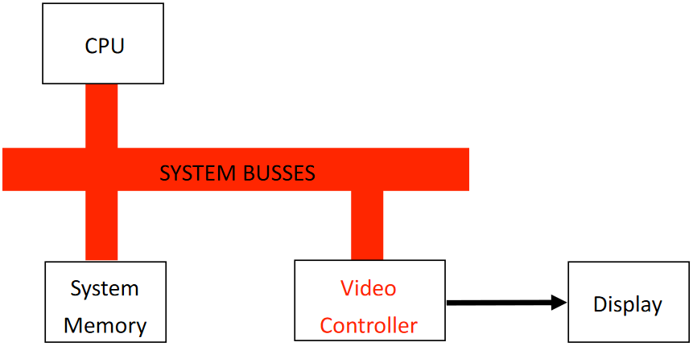
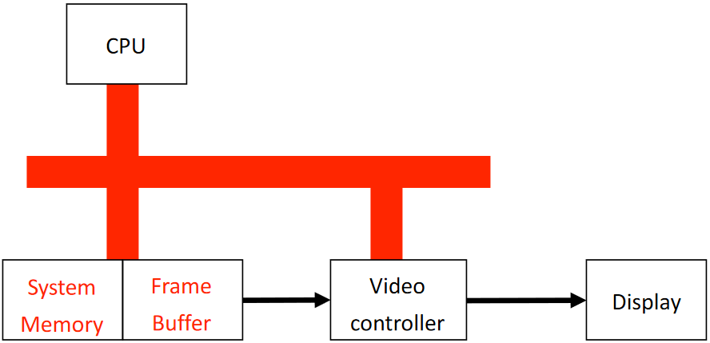
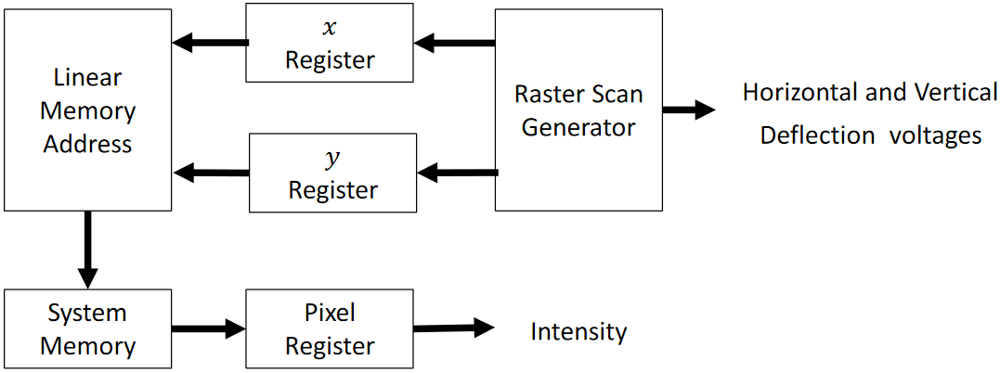
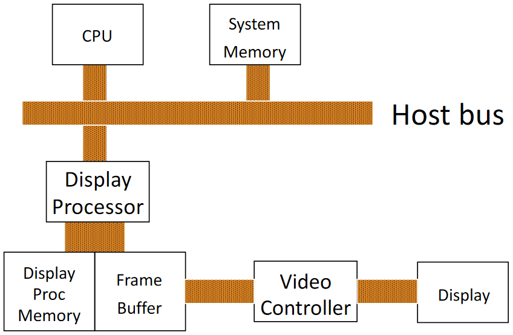

# Graphics Architecture

## Simple Raster Graphics Architecture

- Memory mapped to display
- No rasterisation of primitives
- Simply mapping pixels to display

## Typical Raster Graphics Architecture

Introduces frame buffer

- Separates video memory from main memory
- Accessed via system bus

Advantages

- Simple
- Cheap

Disadvantages

- Software scan conversion
- Graphics controller continuously accesses system memory (dual porting frame buffer helps)

## Video Controller

Display needs

- Position control from raster scan generation
- Intensity from pixel data in system memory

## Video Display Processor

Special purpose CPU for graphics

## Graphics Processing Unit (GPU)

Evolved from display processors

Performs hardware-accelerated graphics operations

Graphics pipline:

- CPU generates object geometry
- GPU generates pixel values for frame buffer

Typical functions:

- Drawing 2D primitives
- Clipping
- Drawing 3D objects
- Shading
- Depth
- Texture mapping
- Video mixing and decompression

## Indexed Colour

Adds Colour Look-Up Table (CLUT) to frame buffer

In a \\(b\\)-bit frame buffer, CLUT holds \\\(2^b\\) colour entries
