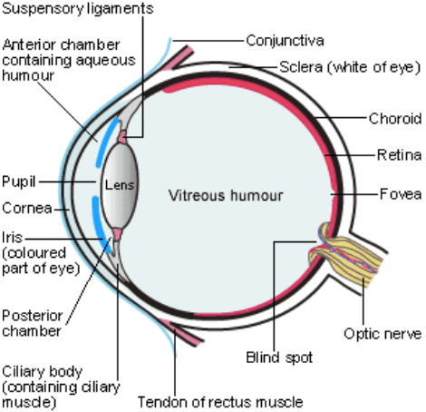
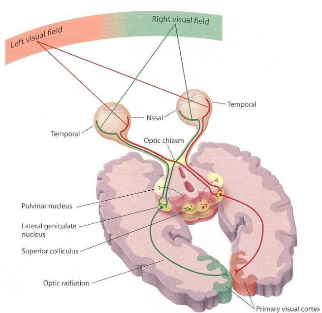

# Human Vision

## Ocular Biology

### Field of View

| Property    | Monocular | Binocular |
| ----------- | --------- | --------- |
| Horizontal° | 160       | 200       |
| Vertical°   | 135       | 135       |

### Retina

10 cell layers

Base layer contains **_rods_** and **_cones_**

Central 1° is **_fovea_**

| Property        | Cones  | Rods                                        |
| --------------- | ------ | ------------------------------------------- |
| Foveal density  | High   | Low (increases towards fovea)               |
| Sensitivity     | Low    | High                                        |
| Detect          | Colour | Luminance (peripheral and low-light vision) |
| Million Per Eye | 6      | 120                                         |
| \# Types        | 3      | 1                                           |

#### Cones

| Property        | Red          | Green      | Blue      |
| --------------- | ------------ | ---------- | --------- |
| Tuned to        | yellow-green | blue-green | violet    |
| Wavelength (nm) | 560          | 530        | 430       |
| Name            | Long (L)     | Middle (M) | Short (S) |

### Visual Pathway

## Visual Perception

Spatiotemporal perception of intensity and colour

Humans can infer

- Shape from
  - **_shading_**
  - **_texture_**
  - **_motion parallax_**
- Depth from
  - **_perspective effects_**
  - **_occlusions_**
  - **_motion parallax_**
  - **_stereo_**
  - **_disparity_**

### Intensity

| Property   | Description                          |
| ---------- | ------------------------------------ |
| Irradiance | Radiant flux per unit area           |
| Radiance   | Radiant flux per wavelength interval |
| Luminance  | Relative brightness                  |
| Lightness  | Uniform perceptual scale             |

### Steven's Power Law

Magnitude of sensation \\(S\\) increases exponentially with stimulus intensity \\(I\\):

\\[
S=I^v
\\]

| Sensation  | \\(v\\) |
| ---------- | ------- |
| Brightness | 0.33    |
| Loudness   | 0.60    |
| Smell      | 0.60    |
| Heaviness  | 1.45    |

### Weber's Law

Just Noticable Difference \\(JND\\) is linearly proportional to absolute intensity \\(I\\)

\\[
JND=\frac{\Delta I}{I}\approx0.01
\\]

### Contrast Ratio

Luminosity ratio of brightest and darkest colour a system can produce

| System       | Contrast Ratio |
| ------------ | -------------- |
| Human vision | 100:1          |
| Printing     | 10:1           |
| LCD          | 400:1-1000:1   |
| CRT Monitors | 80:1           |

Humans perceive ~150 shades of grey
