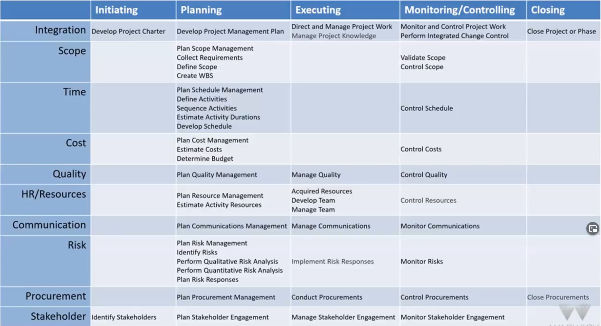

# PMBOK

**_P_**roject **_M_**anagement **_B_**ody **_O_**f **_K_**nowledge by Project Management Institute (PMI).

**Descriptive** standard: _suggests_ PM terminology and guidelines.

- **_10_** Knowledge Areas (KAs) (read each "_X_" as "Project _X_ Management")
  - Scope - establish, balance (See [Iron Triangle](iron_triangle.md))
  - Time - plan, estimate, forecast
  - Cost - plan, budget, finance, fund
  - Quality - estimate, fulfil
  - Risk - plan, identify, analyse, mitigate, monitor
  - Resource - plan, estimate, procure, control
  - Procurement - plan, conduct, control, close
  - Stakeholder - engage, inform, manage expectations
  - Communications - plan, manage, monitor
  - Integration - coordination of the above
- **_5_** Process Groups (PGs)
  - [Initiation](../initiation/initiation.md) - _why the project_?
  - [Planning](../planning/planning.md) - balancing KAs
  - [Execution](../execution/execution.md) - where _real work_ is done
  - [Monitoring and Controlling](../monitoring_and_controlling/monitoring_and_controlling.md) - monitor and review _progress_
  - [Closing](../closing/closing.md) - delivery, audits, lessons
  

- **_49_** Processes, each with
  - Input
  - Tools, techniques, best practices
  - Outputs (documents)
  

