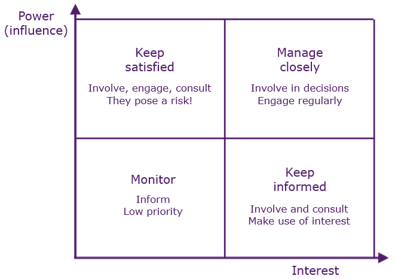

# Stakeholders

Those affected by a project, e.g.:

Stakeholder|Role
-|-
Sponsor|<ul><li>Promotes and provides resources</li><li>Leads during initiation</li></ul>
Customers and users|Beneficiaries of project's product/service/result
Internal groups|Accommodate project activities, e.g. marketing, manufacturing, sales, customer service
Sellers|Provide project components/services
Partners|Provide expertise/service, e.g. installation training/support
Functional managers|Support project, e.g. HR, finance, accounting, procurement
Others|Anyone else with interest in result, e.g. regulators, public

### Power/Interest Grid

Power is static, interest is dynamic: involve/engage/consult.