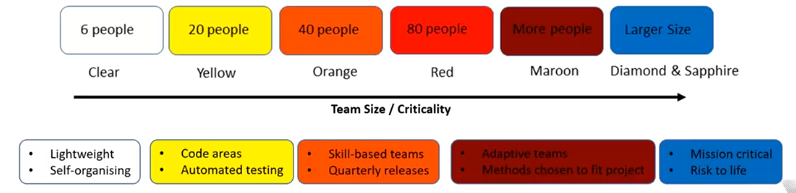

# Agile Variants

## Extreme Programming (XP)

Series of core practices

- Agile planning
- Collaboration
- Pair programming
- Test oriented
- Quality code
- Continuous feedback

## Crystal Method

- Methods that focus on
  - Teamwork
  - Communication
  - Simplicity
- Lightweight
  - More communication
  - Less documentation

## Rapid Application Development (RAD)

- Prototypes, not specifications
- User design phase is important
- Suited to UI building

## Test-Driven Development (TDD)

- Requirements turned into specific test cases before writing code
- Refactor once code passes test harness
- Suited to improving/debugging legacy code

## Feature-Driven Development (FDD)

- Client-value functionality

