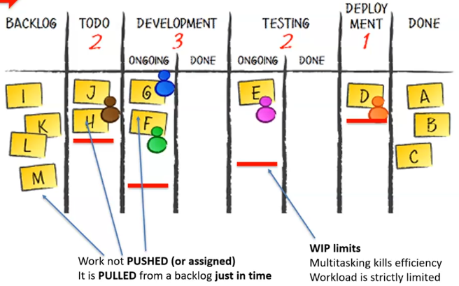
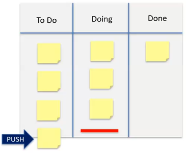
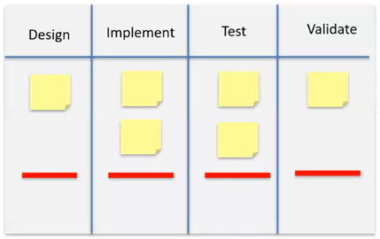

# Kanban

## Overview

"Card that can be seen"

Unit of work

Board position indicates current status

- Visualises workflow
- Limits [WIP](#work-in-progress-wip)
- Manages flow
- Makes process policies explicit
- Improves collaboration

## Flow of Supply and Demand

Supply flows **_downstream_**

Demand flows **_upstream_**

## Method

1. Work is **_pulled_** from backlog [Just-In-Time](lean.md#pillars)
1. Only take work when there is capacity **_downstream_**

## Work In Progress (WIP)

- Forces team/member to work on a **_limited_** number of tasks
- Reduces [muri](lean.md#waste) and overhead of context-switching
- "Leaner to finish one thing to 100% than two to 50%"

## Pull System

- Start new work **_on demand_**
- No to-do list, no muri, complete one thing and then pull next
- "Leaner to focus on completing only what is required"

## Blockers and Idleness

- Taking on work to improve **_your_** output works against the **_team_**
  - Won't maximise **_value_**
  -
- Being blocked forces team to collaborate
  - Focus on solving bottleneck
  - Improve process to achieve [Heijunka](lean.md#foundation)

## Examples

### Typical Workflow

Pros:

- Limits WIP
- PULL from to-do list
- Helps visualise flow

Cons:

- Work PUSHED onto to-do list
- No mapping of processes
- Hard to achieve a rhythm

### Waterfall-Based Workflow

Pros:

- Limits WIP
- Helps visualise flow
- Maps flow of work

Cons:

- Who moves cards?
- Push or pull?
- Signalling?

### Modified Waterfall-Based Workflow

Pros:

- Limits WIP
- Helps visualise flow
- Maps flow of work
- PULL from upstream
- Work done on demand

Cons:

- Load balancing?

### Modified Waterfall-Based Workflow with Swimlanes

Pros:

- Limits WIP
- Helps visualise flow
- Maps flow of work
- Work can be prioritised and expedited
