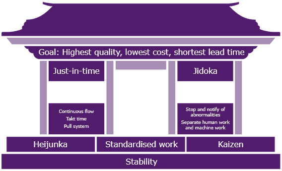
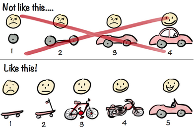

# Lean

## Principles

1. Eliminate waste
1. Create knowledge
1. Defer commitment
1. Deliver fast
1. Respect people
1. Build quality in
1. Optimise the whole

## Waste

| Name | Kanji | Sense                                                                       |
| ---- | ----- | --------------------------------------------------------------------------- |
| Muri | 無理  | <ul><li>Overburden</li><li>Excessiveness</li><li>Unreasonableness</li></ul> |
| Muda | 無駄  | <ul><li>Wastfulness</li><li>Uselessness</li><li>No added value</li></ul>    |
| Mura | 斑    | <ul><li>Unevenness</li><li>Irregularity</li><li>Inequality</li></ul>        |

## Lean House

### Goal

Maximum **_value_**

- High quality
- Low cost
- Fast
- [Iron Triangle](../background/iron-triangle.md)

### Pillars

- Just-In-Time - make what is needed when it is needed
  - Pull system
  - Increase product precision
  - Reduce actual consumption
  - Small lots
  - Low inventories
  - Waste reduction
  - Management by sight
  - Better communication
- Jidoka 自働化 - autonomation
  - Intelligent/partial automation with a 'human touch'

### Foundation

- Heijunka 平準化 - production levelling
  - Smaller, regular batches
  - Steady flow to next stage
  - Greater predictability
  - Flexibility to changing demand
- Standardised work - making things repeatable
- Kaizen 改善 - continuous improvement, reduce [waste](#waste)
  - Regular, incremental improvements
    - To all business functions/processes
    - From employees at all levels
  - Philosophy: culture of active engagement in suggesting and implementing improvements
  - Strategy
    - Trust, respect and empower people
    - Organise events focused on improving the company involving employees at all levels

## Minimum Viable Product (MVP)

Aim: maximise flow of **_value_** to customer

- Minimum - no more than necessary
  - No waste
  - Lower cost
  - Faster delivery
- Viable - valuable
- Product - a deliverable
  - Focus on customer

