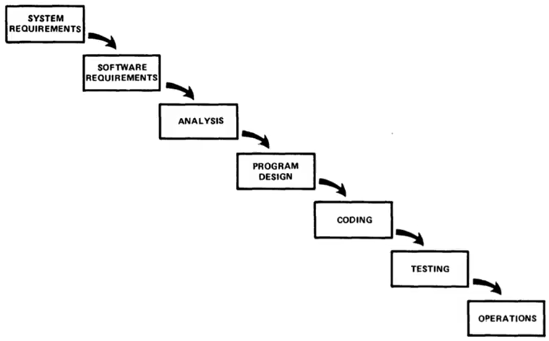

# Waterfall

Pros:

- Repeatable - low management overhead
- Clear about expectations - explicitly collected
- Clear responsibilities and interfaces

Cons:

- High risk - late problem detection incurs major redesign
- One long critical path - estimation and planning become difficult
- Lots of documentation
- No support for **_change_**

## Improvements

1. Complete program design before analysis and coding
1. Documentation must be current and complete
1. Do the job twice if possible
1. Testing must be planned, controlled and monitored
1. Involve customer
