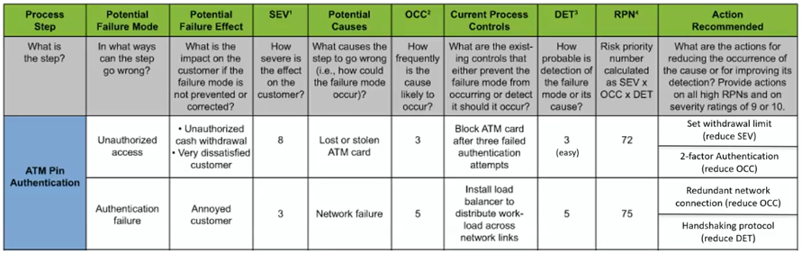

# Failure Mode and Effects Analysis

Table of

- Failure modes - what might go wrong
- Failure effects - damage caused
- Possible causes
- Detection measures
- Bigger numbers \\(\implies\\) **_worse_** outcome

## Method

1. Assign a score (1-10) to
   - Severity \\(S\\)
   - Occurence Probability \\(O\\)
   - Detection Rate \\(D\\)
1. Calculate
   - Criticality \\(C=S\times O\\)
   - Risk Priority Number \\(RPN=C\times D\\)

Highest \\(RPN\\): failure is not detectable, severe and almost certain

