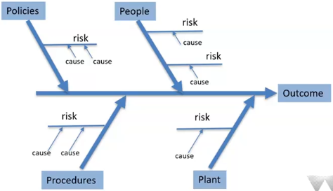

# Ishikawa/Fishbone Diagram

Depicts cause and effect

Work _backwards_ from a risk to think about how it can be mitigated

Considers **_4 Ps_**:

- Policies
- Procedures/Processes
- People
- Plant (Technology)

Break down to any depth

