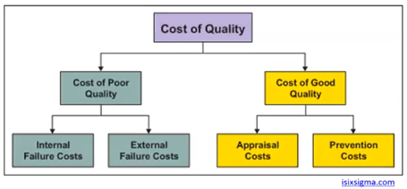
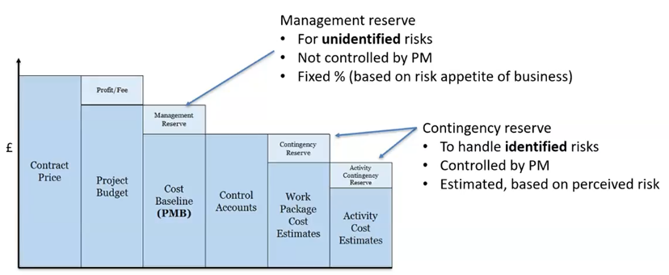
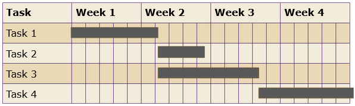
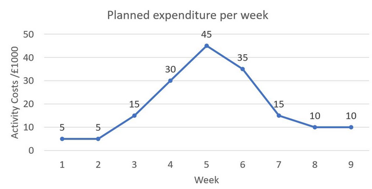
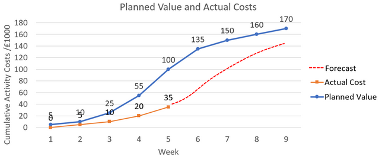
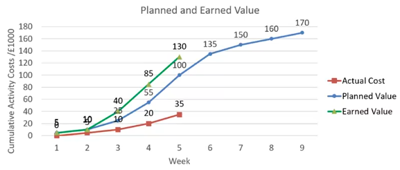
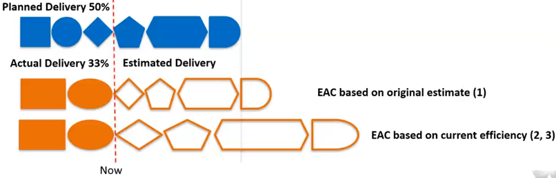
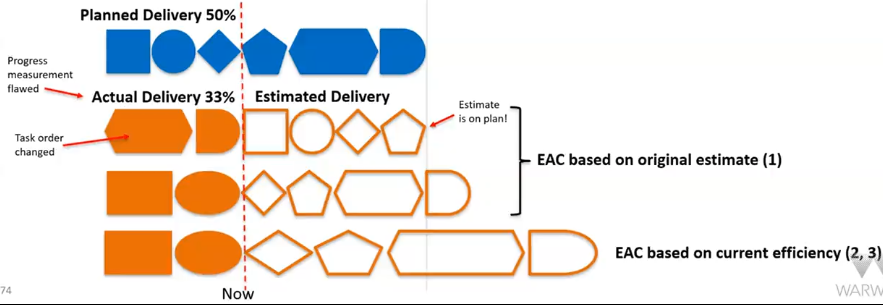

# Budgeting and Forecasting

## Budgeting

Inputs

- Project Management Plan
- Project Charter / Brief
- Environmental Factors and Organisational Assets

Outputs

- Cost Management Plan - how organisation manages **cost variance**
- Activity Estimates - **estimated** cost of each activity
- Cost Baseline - **initial** budget

### Estimation Methods

- Analogous - how much it cost last time
- Parametric - same as analogous but use a mathematical model, e.g. cost/X

  | Metric                 | Budgeting Target Example          |
  | ---------------------- | --------------------------------- |
  | Cost/Time              | HR                                |
  | Cost/Use               | Venue use/cleaning service        |
  | Cost/Material Consumed | Food and drink/bricks for a house |

- Team-based - aggregate team members' estimations
- [Three-point](scope-and-time-management.md#Three-Point-Estimation)
- Vendor Bids - compare bids from competing vendors
- Cost of (Poor) Quality - compare for different quality levels

### Reserves

Estimations will be inaccurate

Reserves mitigate the risk of cost overrun by providing a cost buffer within which to manoeuvre

Reserves may stack across management levels and affect (eat into) profitability

## Charts

- Gant Charts
  - Visualisation of project activities over time
  - Depicts start times, durations, end times and dependencies

- Cash Flow
  - Sum of daily/weekly/monthly planned activity costs
  - Managed by sourcing reserve funds and rescheduling activities to smooth out spikes

- Performance Measurement Baseline (PMB)
  - Planned Value \\(PV\\)
    - Cumulative assigned expenditure
    - Time-phased plan of costs
    - Measured against actual performance
    - Budget At Completion \\(BAC\\) - PV at project end
  - Actual Cost \\(AC\\)
    - How much of budget has been spent
    - Compare to planned value
    - Under budget or running late?
  - Forecast
    - Estimates cost of future work
    - Based on assumptions:
      - Under budget or running late?
      - Future efficiency same as current?

## Earned Value Analysis (EVA)

- Earned Value \\(EV\\)
  - How much planned value achieved by work so far?
  - Indicates progress

COW = Cost of Work

| Variable                   | Symbol    | Description                         | Formula/Derived from         |
| -------------------------- | --------- | ----------------------------------- | ---------------------------- |
| Budget At Completion       | \\(BAC\\) | Total Budgeted COW                  | Budget                       |
| Planned Value              | \\(PV\\)  | Budgeted COW Scheduled              | \\(BAC\times Scheduled\\%\\) |
| Actual Cost                | \\(AC\\)  | Actual COW                          | Measured                     |
| Earned Value               | \\(EV\\)  | Budgeted COW                        | \\(BAC\times Done\\%\\)      |
| Schedule Variance          | \\(SV\\)  | On schedule?                        | \\(EV-PV\\)                  |
| Cost Variance              | \\(CV\\)  | Within budget?                      | \\(EV-AC\\)                  |
| Schedule Performance Index | \\(SPI\\) | Working quickly?                    | \\(\frac{EV}{PV}\\)          |
| Cost Performance Index     | \\(CPI\\) | Working cost-effectively?           | \\(\frac{EV}{AC}\\)          |
| Cost Schedule Index        | \\(CSI\\) | Overall efficiency (time and money) | \\(SPI\times CPI\\)          |

Straightforward to calculate and compare these quantities to evaluate the project's status in terms of:

- Budget
- Timeliness

## Forecasting

Three ways to predict future cost and time efficiency:

- Use **_original_** estimates
- Assume **_cost-efficiency_** to date
- Assume cost **_and_** schedule-efficiency to date

Must also consider the difficulty and order of tasks

| Variable                      | Symbol            | Description                                | Formula/Derived from        |
| ----------------------------- | ----------------- | ------------------------------------------ | --------------------------- |
| Estimate At Completion        | \\(EAC\\)         | Estimated cost based on progress to date   | \\(\frac{BAC}{CPI}\\)       |
|                               |                   | Estimated cost based on original estimate  | \\(AC+(BAC-EV)\\)           |
|                               |                   | Estimated cost based on overall efficiency | \\(AC+\frac{BAC-EV}{CSI}\\) |
| Estimate To Complete          | \\(ETC\\)         | Estimated cost to finish work              | \\(EAC-AC\\)                |
| Variance At Completion        | \\(VAC\\)         | Expected overspend/savings                 | \\(BAC-EAC\\)               |
| To-Complete Performance Index | \\(TCPI\_{EAC}\\) | Cost-efficiency to achieve \\(EAC\\)       | \\(\frac{BAC-EV}{EAC-AC}\\) |
|                               | \\(TCPI\_{BAC}\\) | Cost-efficiency to achieve \\(BAC\\)       | \\(\frac{BAC-EV}{BAC-AC}\\) |
