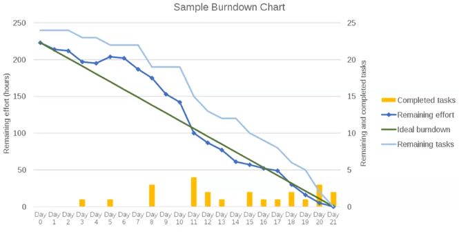

# KPIs

## Measuring Project Success

Common targets:

- Budget
- Schedule
- Scope

Equally important:

- Product quality
- Product necessity, is it utilised?
- Business objectives
- Effective use of resources
- Future support and maintenance
- Pride of ownership
- Standards and best practices
- Methods to evaluate benefit realisation

## Key Performance Indicators (KPIs)

High-level indicators

- Simple, measurable metrics
- Correlated to stakeholder objectives
- Agreed between PM and stakeholders

Metrics of success

- Metrics critical to all stakeholders?

Measure of progress

- Track progress towards goals

### Benefits

- Hitting targets/milestones?
- Getting better/worse?
- Identify mistakes/issues
- Inform decisions and management

### Methods

Burndown chart

Other KPIs:

- Scope
  - % tasks complete
  - Size of to-do list
  - \# of scope review meetings
- Timeliness
  - % tasks on time
  - Time spent on schedule
  - \# of schedule revisions
- Budget
  - % tasks on budget
  - [Cost Variance](budgeting-and-forecasting.md#forecasting)
  - Time to create budget
  - \# of budget revisions
- Quality
  - Ratings of customer satisfaction
  - \# of bugs/errors
  - \# of complaints
- Efficiency/Effectiveness
  - % resource utilisation
  - \# of missed milestones
  - Rate of returns
- Project
  - Return On Investment (ROI)
  - Operating margins
  - Time to achieve value
  - Cost of management
  - % project complete
  - % projects over-budget

## Enterprise Resource Planning (ERP)

- Business analytics
- Central database tracking all parts of company in real-time
- Data-driven managment
  - Visualise metrics on dashboard
  - Quickly spot issues
  - Manage management
