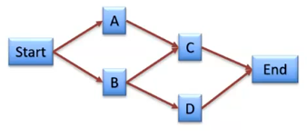
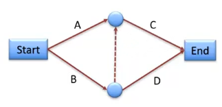
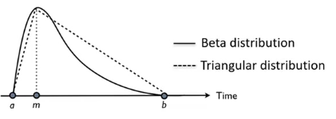
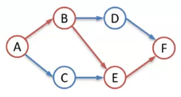

# Scope and Time Management

## Project Network Diagrams

Derived from dependency chart:

| Task | Dependencies |
| ---- | ------------ |
| A    | -            |
| B    | -            |
| C    | A, B         |
| D    | B            |

Activity on Node:

Activity on Edge:

## Critical Path Method (CPM)

| Variable        | Symbol          | Description                                                           | Formula/Derived from                              |
| --------------- | --------------- | --------------------------------------------------------------------- | ------------------------------------------------- |
| Critical Path   | \\(P\_{crit}\\) | First to last activity. Delaying \\(a\in P\_{crit}\\) extends project | CPM                                               |
| Duration        | \\(D\\)         | Activity length                                                       | Estimates                                         |
| Earliest Start  | \\(ES\\)        | Earliest time activity can start                                      | \\(ES=\underset{p\in pred(a)}{argmax}\\, EF(p)\\) |
| Earliest Finish | \\(EF\\)        | Earliest time activity can finish                                     | \\(EF=ES+D\\)                                     |
| Latest Finish   | \\(LF\\)        | Latest time activity can finish                                       | \\(LF=\underset{s\in succ(a)}{argmin}\\, LS(s)\\) |
| Latest Start    | \\(LS\\)        | Latest time activity can start                                        | \\(LS=LF-D\\)                                     |
| Total Float     | \\(TF\\)        | Possible delay without delaying project                               | \\(TF=LS-ES=LF-EF\\)                              |

### Algorithm

1. Construct PND
1. Forward pass calculates:
   - \\(ES\\)
   - \\(EF\\)
1. Backward pass calculates:
   - \\(LF\\)
   - \\(LS\\)
   - \\(TF\\)

## Program Evaluation and Review Technique (PERT)

- Probabilistic version of CPM that factors in **_uncertainty_**
- Skeptical of time estimates
- Variation of CPM using **_three-point_** estimation
  - \\(a\\) - shortest possible time
  - \\(m\\) - most likely time
  - \\(b\\) - longest possible time

| Distribution | \\(t\\)                | \\(\sigma^2\\)                        |
| ------------ | ---------------------- | ------------------------------------- |
| \\(\beta\\)  | \\(\frac{a+4m+b}{6}\\) | \\((\frac{b-a}{6})^2\\)               |
| triangular   | \\(\frac{a+b+m}{3}\\)  | \\(\frac{a^2+b^2+m^2-ab-am-bm}{18}\\) |

### Method

Work out critical path \\(P\_{crit}\\) as before:

Calculate \\(t\\) and \\(\sigma\\) for \\(P\_{crit}\\):

| Task | \\(a\\) | \\(m\\) | \\(b\\) | \\(t\\) | \\(\sigma\\)      |
| ---- | ------- | ------- | ------- | ------- | ----------------- |
| A    | 2       | 5       | 8       | 5       | 1                 |
| B    | 1       | 2       | 9       | 3       | \\(\frac{4}{3}\\) |
| E    | 1       | 2       | 9       | 3       | \\(\frac{4}{3}\\) |
| F    | 1       | 3       | 11      | 4       | \\(\frac{5}{3}\\) |

Expected project duration is sum of means along the critical path:

\\[
E(t)=\sum_{a\in P_{crit}}{t(a)}=5+3+3+4=15
\\]

Expected project variance is sum of **_squares of_** \\(\sigma\\) along the critical path:

\\[
E(var)=\sum_{a\in P_{crit}}{\sigma(a)^2}=1+\frac{16}{9}+\frac{16}{9}+\frac{25}{9}=\frac{66}{9}
\\]

So \\(t=15\\), \\(\sigma=\sqrt{\frac{66}{9}}=\frac{\sqrt{66}}{3}\approx2.7\\)

Or, _"The project will take 15 days \\(\pm\\) 2.7 days"_

PDF gives confidence level that project will be completed before a certain time

**_But_**:

- Assumes normally distributed
- Requires uncertainty estimation
- False sense of precision
