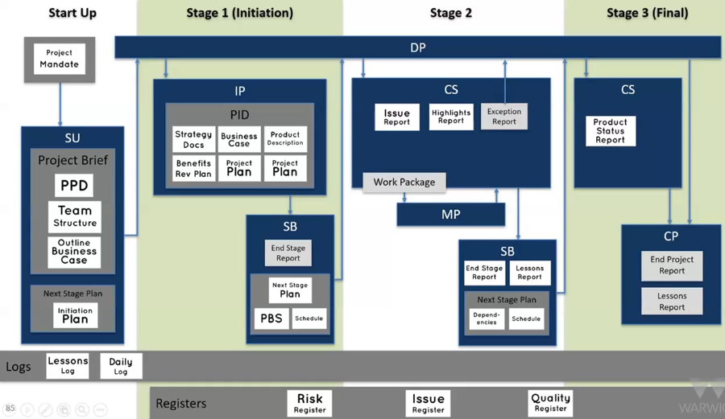

# Management Products

Project delivers _products_, not _activities_

- Work towards a product's _specification_
- Aim to assure a product's _quality_

To _produce_ a product:

| Document                    | Purpose                            |
| --------------------------- | ---------------------------------- |
| Product Description         | Specification and quality criteria |
| Product Breakdown Structure | Deliverable-oriented WBS           |
| Product Flow Diagram        | Network of product's dependencies  |

### By Theme

| Theme         | Management Product(s)                                                                                                                  |
| ------------- | -------------------------------------------------------------------------------------------------------------------------------------- |
| Business Case | <ul><li>Outline Business Case</li><li>Business Case</li></ul>                                                                          |
| Organisation  | Project Management Team Structure                                                                                                      |
| Plans         | <ul><li>Project Plan</li><li>Initiation Stage Plan</li><li>Next Stage Plan</li><li>Team Plan</li><li>Exception Plan</li></ul>          |
| Quality       | <ul><li>Project Product Description</li><li>Quality Management Strategy</li><li>Product Description</li><li>Quality Register</li></ul> |
| Progress      | <ul><li>Progress Report</li><li>Exception Report</li></ul>                                                                             |
| Risk          | Risk Register                                                                                                                          |
| Change        | <ul><li>Exception Report</li><li>Issue Register</li><li>Issue Report</li></ul>                                                         |
