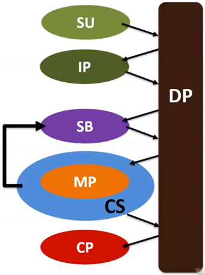
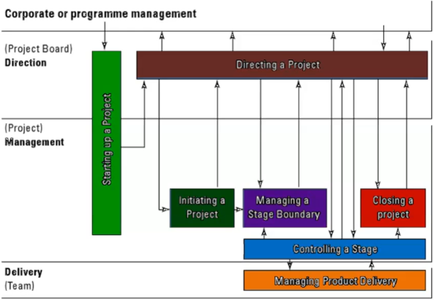

# Processes

| Abbreviation | Name                      |
| ------------ | ------------------------- |
| SU           | Starting Up a project     |
| IP           | Initiating a Project      |
| DP           | Directing a Project       |
| SB           | Managing Stage Boundaries |
| MP           | Managing Product Delivery |
| CS           | Controlling a Stage       |
| CP           | Closing a Project         |

1. Project externally initiated by Project Board with Project Mandate
   - Appoints PM
1. Agreement between Project Board and Managers
   - Who does what?
   - Objectives?
   - Formalises project's existence
1. Project Plan sketched out in rough
   - General activities, strategy and budget
1. Project Plan signed off by Project Board
1. Specific Stage Plan formulated, happens at beginning of project cycle
1. Stage Plan approved by Project Board
1. Stage managed by PM
   - Authority given to team
   - Team does work
1. Manager checks progress
   - Removes blockers
   - Changes plan if necessary
   - Raise exception to Project Board if necessary
1. If all goes well, return to formulate Stage Plan
1. Once Project Board believes project is done, i.e. deliverables meet targets, project closure authorised

    
    

